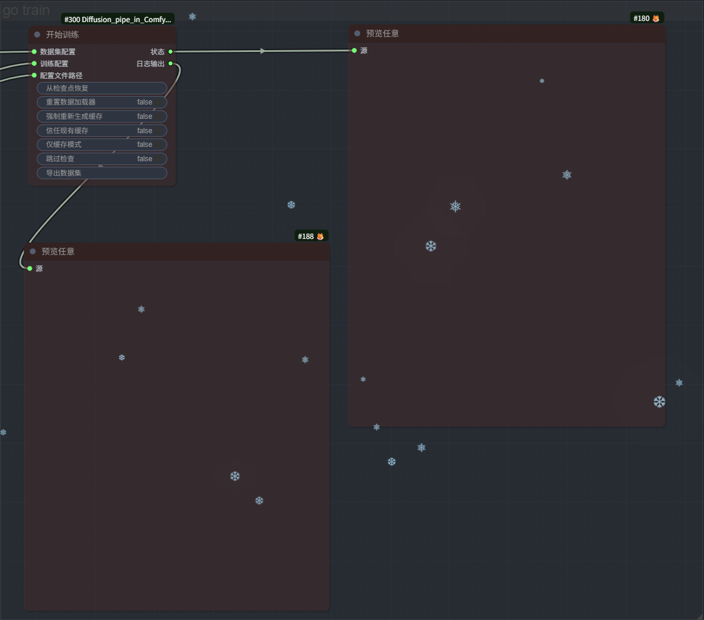
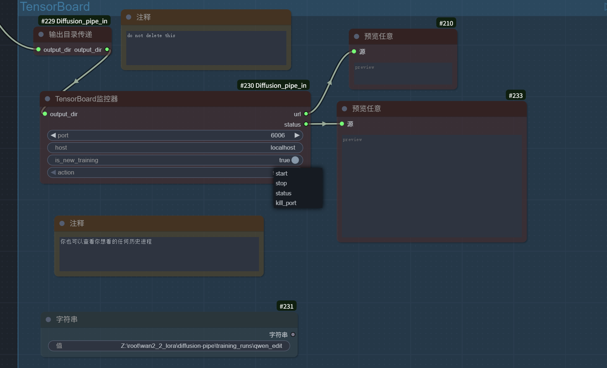

 

 # Diffusion-Pipe In ComfyUI 自定义节点

 <div align="center">

  [](https://github.com/TianDongL/Diffusion_pipe_in_ComfyUI_Win.git)

  [](https://github.com/tdrussell/diffusion-pipe.git)

  
</div>


*click to see [English](./README.md)*

## 项目简介

Diffusion-Pipe In ComfyUI 自定义节点是一个强大的扩展插件，为 ComfyUI 提供了完整的 Diffusion 模型训练和微调功能。这个项目允许用户在 ComfyUI 的图形界面中配置和启动各种先进 AI 模型的训练，支持 LoRA 和全量微调，涵盖了当前最热门的图像生成和视频生成模型。

***视频演示：https://www.bilibili.com/video/BV1DAnKzTEup/?share_source=copy_web&vd_source=5a2c3d8b60d05e98a2e7f4f58f77eba5***

***[📋 查看支持的模型](./docs/supported_models.md)***


# 快速开始

## 更新日志 

* 20251026:评估支持

* 20251030:支持aura模型训练

* 20251103:支持多图像编辑（qwen2509）

* 20251105:支持遮罩训练，修复了使用示例作为x轴时绘图中的一个错误，允许在没有tar文件的情况下使用captions.json，添加reset_optimizer标志，--reset_optimiser_params标志（重置优化器参数，可以在继续训练时重置优化器），修复数据集问题，在数据集缓存中将Cast转换为float16以将磁盘大小减半

## 安装指南

### 安装 
确保你在Linux或者WSL2系统上拥有ComfyUI，参考https://docs.comfy.org/installation/manual_install

ps:WSL2上的comfyui十分好用，我甚至想删除我在win上的comfyui


```bash
conda create -n comfyui_DP python=3.12
```
```bash
conda activate comfyui_DP
```

```bash
cd ~/comfy/ComfyUI/custom_nodes/
```

```bash
git clone --recurse-submodules https://github.com/TianDongL/Diffusion_pipe_in_ComfyUI.git
```

* 如果你没有安装子模块，进行以下步骤 

* 如果你不进行此步骤，训练将无法进行

```bash
git submodule init
git submodule update
```

# 安装依赖
```bash
conda activate comfyui_DP
```
这里是deepspeed的必要依赖，首先安装 PyTorch。它未在需求文件中列出，因为某些 GPU 有时需要不同版本的 PyTorch 或 CUDA，您可能必须找到适合您的硬件的组合。
```bash
pip install torch==2.7.1 torchvision==0.22.1 torchaudio==2.7.1 --index-url https://download.pytorch.org/whl/cu128
```
```bash
cd ~/comfy/ComfyUI/custom_nodes/Diffusion_pipe_in_ComfyUI
```
```bash
pip install -r requirements.txt
```

## 🚀 一键导入工作流

为了让你快速开始，我提供了预配置的 ComfyUI 工作流文件：

***[📋 点击导入完整工作流](./example_workflows/DiffusionPipeInComfyUI.json)***

将此文件拖拽到 ComfyUI 界面中即可导入完整的训练工作流，包含所有必要的节点配置。

## 请仔细阅读工作流中的提示，这可以帮助你进行数据集的构建


# 📷 工作流界面预览

<div align="center">


模型可以存放在comfyui的模型目录下


*调试时禁用Train节点*


模型可以存放在comfyui的模型目录下


数据集配置


工作流总览


*kill port会停止当前端口一切监控进程*

</div>


### 核心特性

- 🎯 **可视化训练配置**: 通过 ComfyUI 节点图形化配置训练参数
- 🚀 **多模型支持**: 支持 20+ 种最新的 Diffusion 模型
- 💾 **灵活训练方式**: 支持 LoRA 训练和全量微调
- ⚡ **高性能训练**: 基于 DeepSpeed 的分布式训练支持
- 📊 **实时监控**: 集成 TensorBoard 监控训练过程
- 🔧 **WSL2 优化**: 专门优化的 Windows WSL2 环境支持
- 🎥 **视频训练**: 支持视频生成模型的训练
- 🖼️ **图像编辑**: 支持图像编辑模型的训练

## 系统要求

### 硬件要求
- * 我不知道，你可以尝试 :-P	

### 软件要求
- **操作系统**: Linux / Windows 10/11 + WSL2
- **ComfyUI**: 最新版本


## 支持的模型

本插件支持超过 20 种最新的 Diffusion 模型，包括：

| Model          | LoRA | Full Fine Tune | fp8/quantization |
|----------------|------|----------------|------------------|
|SDXL            |✅    |✅              |❌                |
|Flux            |✅    |✅              |✅                |
|LTX-Video       |✅    |❌              |❌                |
|HunyuanVideo    |✅    |❌              |✅                |
|Cosmos          |✅    |❌              |❌                |
|Lumina Image 2.0|✅    |✅              |❌                |
|Wan2.1          |✅    |✅              |✅                |
|Chroma          |✅    |✅              |✅                |
|HiDream         |✅    |❌              |✅                |
|SD3             |✅    |❌              |✅                |
|Cosmos-Predict2 |✅    |✅              |✅                |
|OmniGen2        |✅    |❌              |❌                |
|Flux Kontext    |✅    |✅              |✅                |
|Wan2.2          |✅    |✅              |✅                |
|Qwen-Image      |✅    |✅              |✅                |
|Qwen-Image-Edit |✅    |✅              |✅                |
|HunyuanImage-2.1|✅    |✅              |✅                |
|AuraFlow        |✅    |❌              |✅                |


## 许可证

本项目基于 Apache License 2.0 许可证开源。

## 贡献指南

欢迎提交 Issue 和 Pull Request！

1. Fork 项目
2. 创建功能分支
3. 提交更改
4. 发起 Pull Request

## 致谢

感谢以下项目和团队：
- ComfyUI 团队
- Diffusion_Pipe的原作者 [@tdrussell](https://github.com/tdrussell/diffusion-pipe.git)
- Hugging Face Diffusers
- DeepSpeed 团队
- 各模型原始作者


